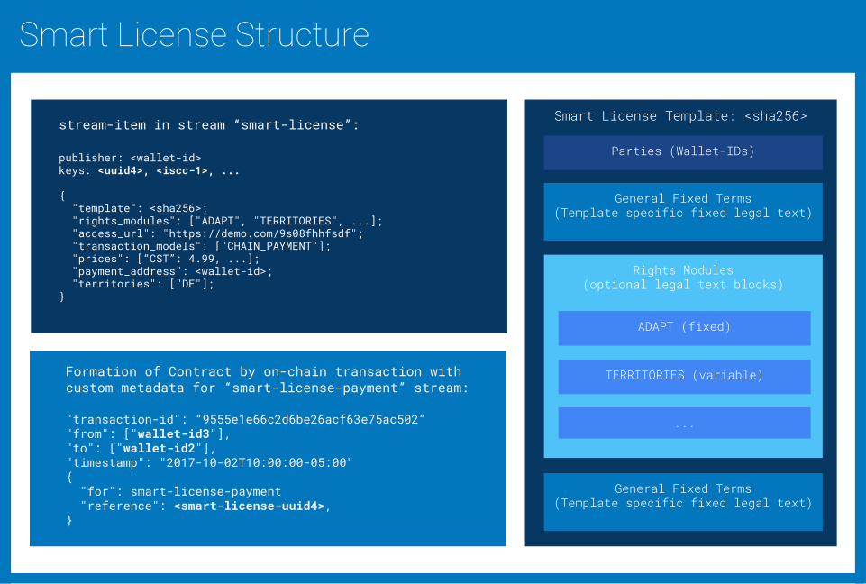

# Smart Licenses v.0.9.9

| CIP:     | 0004                                                         |
| -------- | ------------------------------------------------------------ |
| Title:   | Smart Licenses                                               |
| Authos:  | Till Kreutzer, Sebastian Posth, Titusz Pan                   |
| Status:  |        |
| Created: | 2018-01-12                                                   |
| License: | [CC0 - Public Domain Dedication](https://creativecommons.org/publicdomain/zero/1.0/legalcode) |


## Abstract

*This document specifies the **Smart License** framework together with its data-structures, data-streams, and transaction-models that are used to publish and verify machine readable licenses and contracting rules on the Content Blockchain.*

## Purpose

Allow people and machines to find license information and easily purchase, own and prove ownership of content licenses. Allow content owners, resellers and distributors to offer, monetize and verify content licenses.

## Definitions

### General Terms

Content Blockchain:
: 	Technical system to enable rights owners like **creators** or publishers to license content to users and to register the license transactions publicly and persistently on a blockchain technology.

Creator:
:    The person who created the licensed material (e.g. a composer or an author).

ISCC:
:    International Standard Content Code - a unique ID (content identifier) that defines the **licensed material** as a machine-readable code.

Licensee/You:
:    “**Licensee**” or “**You**”: the individual or entity exercising the rights under this smart license. **Your** has a corresponding meaning.

Licensed Material:
:    The artistic or literary work, database, or other copyright protected material to which the licensor applied this smart license. The licensed material is identified by a unique **ISCC**

Licensor:
:    The individual(s) or entity(ies) granting rights under this license. The licensor can be the creator or another copyright owner (like e.g. a publisher).

Rights Module:
:    A standardized section of the **smart license** that describes a certain  kind of use. The licensor can choose from a number of rights modules to define the  scope of his/her **smart license**. 

Rights Profile:
:    The combination of **rights modules** the licensor chose for his smart license.

Smart License:
:    The sum of rules that apply for the use of the licensed material.

Term:
:    The period of time the **smart license** is valid for.

Territory:
:    The geographical scope of the smart license.

Wallet-ID:
:    A random public identifier whose private key is only known by the person(s) that created the wallet id. A Smart License is issued to a Wallet ID 
which acts as a proxy for its owner(s). The wallet id together with its 
private key can be used to prove licence ownership.

### Rights Modules

Adapt:
:    Modify, alter or change the licensed material in any way (e.g. remixing, transforming, shortening, translating, synchronizing, combining with other material). Adaptations may also be shared.

Lend:
:    The temporary surrender of the licensed material to another person or entity without compensation. 

Resale:
:    Copy the **licensed material** in any medium or format (digital, analogue, tangible, intangible). Making available or distribute the material is not subject of **reproduce** but **share**.

share:
:    Make the **licensed material** accessible to third parties in digital form. Share means e.g. to publicly display, perform or present the material, to broadcast, stream or make it online available. In case these uses require copying the material the necessary **reproductions** are covered, too. 


distribute:
:    “**Distribute**” means to make physical reproductions of the **licensed material** (like printing a text or burning a CD) and to convey the copies to third parties. The offer to convey copies is a distribution, too.

rent:
:    “**Rent**” is the temporary surrender of the licensed material to another person or entity for compensation.

### Restrictions

Non-commercial:
:    “**Non-commercial**” means not primarily intended for or directed towards commercial advantage or monetary compensation. For purposes of this smart license, the **resale** of the **licensed material** is non-commercial.

No Industrial Property Rights:
:    Patent and trademark rights are not licensed under this **smart license**.

### Obligations

Attribution:
:    You have to pertain notices that are supplied with the **licensed material** when you **share** or **distribute** it. Under this obligation you have to:

    - Retain credits to the creator and/or the publisher;  
    - Retain copyright notices;
    - If so stipulated by the licensor retain an URL or hyperlink to an online source of the licensed material

Fair Share:
:    If you sell your **smart license** a part of your sales revenue will be shared with the licensor. The licensor will provide information about the share ratio and other details ...

indicate adaptations:
:    If you share an adapted version of the **licensed material** you have to indicate that your **adaptation** bases on the **licensed material** in a reasonable manner. You have to name the **creator**, copyright owner and **licensor** of the material according to the **attribution** obligation. If  you share **adaptations** you must not imply that they are authorised or otherwise endorsed by the **licensor**.

## Introduction

A **Smart License** is encoded as a JSON data structure that holds information about licensing conditions by a given licensor and for a given content. Applications can construct a human readable textual license contract based on Smart License data. A Smart Licence may constitute a public license offering 
when published to the Content Blockchain.



## Transaction Models

A **Transaction Model** describes a series of verifiable on-chain events that trigger the formation of a **Smart License Contract** between licensor(s) and licensee(s). They also describe the procedures to find, display and verify such contracts based on data available on the blockchain. We propose three basic **Transaction Models**:


!!! note

    The current idea is to allow multiple Transaction Models per Smart License. 
    We considering to only allow to set one Transaction Model per Smart License, 
    because it might turn out to be tricky to verify contract formation/triggers 
    with an overly flexible model.

### Chain Attestation

Dictates that a license contract becomes effective between Licensor and Licensee when an on-chain attestation originating from the Walled-ID of the licensor has been confirmed on the blockchain. An on-chain attestation has to include references to a Smart License and the Wallet-ID of the licensee.

A **Smart License** that specifies `CHAIN_ATTESTATION` as one of its allowable **Transaction Models** can be triggered by the publisher of the **Smart License** independent of a price or payment method. The **Licensor** does this by attesting to the license grant with an on-chain entry to the data-stream `smart-license` that references starts with the message type `ATT`  and indicates the Licensee by Wallet-ID and the Smart License itself by UUID4.

!!! example


```json
{"keys": ["ATT", "dac9a2f5-8bfc-4f20-b665-42e1606812ac"]}
```


# OLD NOTEs (to reworked)

## Schema

The SmartLicense protocol uses multiple streams. All streams are readable and 
writable by every blockchain participant. A SmartLicense is identified by a 
publisher provided UUID Version 4. 
See [smartlicense.proto](../smartlicense/smartlicense.proto) for current state 
of data structure for SmartLicenses.

## Streams

- `smartlicense`: the primary stream to publish SmartLicenses
- `smartlicense-attestation`: for publishing license attestations

## Transaction Models

### Attestation Example

This is an example that demostrates attestation based licensing process.

#### Creating an attestion based SmartLicense

A publisher creates a SmartLicense with a frontend application. The 
application then creates an encoded version of the data collected from the 
user. A minimal JSON-encoded SmartLicense looks like this:

```json
{
  	"materials": ["2EvGugzdGh5Zp-2LpzWi7kt2kUA-2LpprH51GMPhq-2VhLRzBEdDLa4"],
  	"activation_modes": ["ON_CHAIN_ATTESTATION"]
}
```

In this example the `licensors` and the `payment_address` fields are not 
explicitly specified. Both will be set  to the **Wallet-ID** of the entity 
that published the SmartLicense to the blockchain. The application also 
generates a **UUID4** as identifier for a specific SmartLicense. The 
application publishes the SmartLicense as a multichain stream-item signed by 
the publisher to the `smartlicense` stream with the **UUID4** as key and the 
SmartLicense as data. The data is published in a compact binary encoding 
(protobuf).

#### Issuing  a License to a user

The publisher registers an entry in the  `smartlicense-attestation` - stream 
with the **Wallet-ID** of the user as key and the **SmartLicense UUID4** as 
data.

#### Verifying a License for a user

Given an ISCC content identifier:

- Ask the user to sign a random nonce with his Wallet-ID
- Lookup the `smartlicense-attestation` stream for SmartLicenses attested to 
the user
- ...

### On-Chain Payment
...

## Validation

The first time given UUID4 is published to the stream as an item-key it is 
considered to be owned by the publishing Wallet-ID(s). Subsequent stream
entries with the same UUID4 key must be ignored if they are signed by a 
different Wallet-ID.
