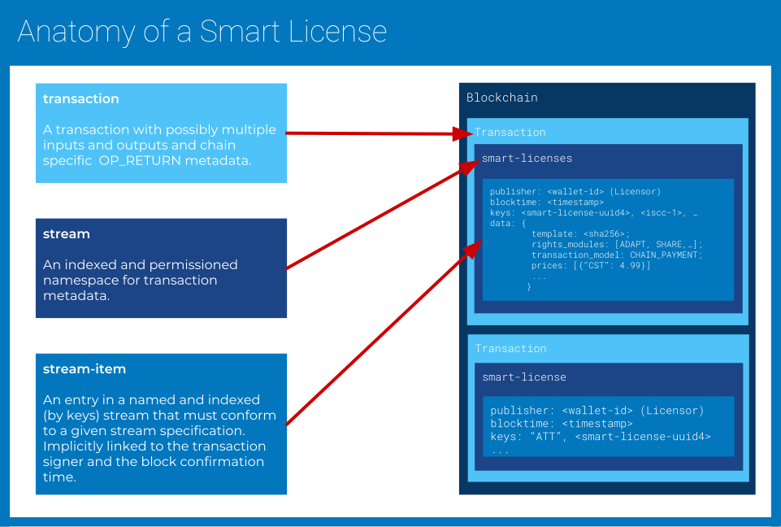

# Smart Licenses v.0.9.9

| CIP:     | 0004                                                         |
| -------- | ------------------------------------------------------------ |
| Title:   | Smart Licenses                                               |
| Authors: | Till Kreutzer, Sebastian Posth, Titusz Pan                   |
| Status:  |        |
| Created: | 2018-01-12                                                   |
| License: | [CC0 - Public Domain Dedication](https://creativecommons.org/publicdomain/zero/1.0/legalcode) |


## Abstract

*This document specifies the **Smart License** framework together with its data-structures, data-streams, and transaction-models that are used to publish and verify machine readable licenses and contracting rules on the Content Blockchain.*

## Purpose

Allow people and machines to find license information and easily purchase, own and prove ownership of content licenses. Allow content owners, resellers and distributors to offer, monetize and verify content licenses.

## Definitions

### General Terms

Content Blockchain:
: 	Technical system to enable rights owners like **creators** or publishers to license content to users and to register the license transactions publicly and persistently on a blockchain technology.

Creator:
:    The person who created the licensed material (e.g. a composer or an author).

ISCC:
:    International Standard Content Code - a unique ID (content identifier) that defines the **licensed material** as a machine-readable code.

Licensee/You:
:    “**Licensee**” or “**You**”: the individual or entity exercising the rights under this smart license. **Your** has a corresponding meaning.

Licensed Material:
:    The artistic or literary work, database, or other copyright protected material to which the licensor applied this smart license. The licensed material is identified by a unique **ISCC**

Licensor:
:    The individual(s) or entity(ies) granting rights under this license. The licensor can be the creator or another copyright owner (like e.g. a publisher).

Rights Module:
:    A standardized section of the **smart license** that describes a certain  kind of use. The licensor can choose from a number of rights modules to define the  scope of his/her **smart license**. 

Rights Profile:
:    The combination of **rights modules** the licensor chose for his smart license.

Smart License:
:    The sum of rules that apply for the use of the licensed material.

Term:
:    The period of time the **smart license** is valid for.

Territory:
:    The geographical scope of the smart license.

Wallet-ID:
:    A random public identifier whose private key is only known by the person(s) that created the wallet id. A Smart License is issued to a Wallet ID 
which acts as a proxy for its owner(s). The wallet id together with its 
private key can be used to prove licence ownership.

### Rights Modules

Adapt (AD):
:    Modify, alter or change the licensed material in any way (e.g. remixing, transforming, shortening, translating, synchronizing, combining with other material). Adaptations may also be shared.

Lend:
:    The temporary surrender of the licensed material to another person or entity without compensation. 

Resale (RS):
:    Copy the **licensed material** in any medium or format (digital, analogue, tangible, intangible). Making available or distribute the material is not subject of **reproduce** but **share**.

Share (SH):
:    Make the **licensed material** accessible to third parties in digital form. Share means e.g. to publicly display, perform or present the material, to broadcast, stream or make it online available. In case these uses require copying the material the necessary **reproductions** are covered, too. 


Distribute:
:    “**Distribute**” means to make physical reproductions of the **licensed material** (like printing a text or burning a CD) and to convey the copies to third parties. The offer to convey copies is a distribution, too.

Rent:
:    “**Rent**” is the temporary surrender of the licensed material to another person or entity for compensation.

### Restrictions

Non-commercial (NC):
:    “**Non-commercial**” means not primarily intended for or directed towards commercial advantage or monetary compensation. For purposes of this smart license, the **resale** of the **licensed material** is non-commercial.

No Industrial Property Rights (NI):
:    Patent and trademark rights are not licensed under this **smart license**.

### Obligations

Attribution (AT):
:    You have to pertain notices that are supplied with the **licensed material** when you **share** or **distribute** it. Under this obligation you have to:

    - Retain credits to the creator and/or the publisher;  
    - Retain copyright notices;
    - If so stipulated by the licensor retain an URL or hyperlink to an online source of the licensed material

Fair Share:
:    If you sell your **smart license** a part of your sales revenue will be shared with the licensor. The licensor will provide information about the share ratio and other details ...

Indicate Adaptations (IA):
:    If you share an adapted version of the **licensed material** you have to indicate that your **adaptation** bases on the **licensed material** in a reasonable manner. You have to name the **creator**, copyright owner and **licensor** of the material according to the **attribution** obligation. If  you share **adaptations** you must not imply that they are authorised or otherwise endorsed by the **licensor**.

## Introduction

A **Smart License** is encoded as a JSON data structure that holds information about licensing conditions by a given licensor and for a given content. Applications can construct a human readable textual license contract based on Smart License data. A Smart Licence may constitute a public license offering 
when published to the Content Blockchain.


## Transaction Models

A **Transaction Model** describes a series of verifiable on-chain events that trigger the formation of a **Smart License Contract** between licensor(s) and licensee(s). They also describe the procedures to find, display and verify such contracts based on data available on the blockchain. We propose three basic **Transaction Models**:


!!! note

    The current idea is to allow multiple Transaction Models per Smart License. 
    We considering to only allow to set one Transaction Model per Smart License, 
    because it might turn out to be tricky to verify contract formation/triggers 
    with an overly flexible model.

### Chain Attestation

Dictates that a license contract becomes effective between Licensor and Licensee when an on-chain attestation originating from the Walled-ID of the licensor has been confirmed on the blockchain. An on-chain attestation has to include references to a Smart License and the Wallet-ID of the licensee.

A **Smart License** that specifies `CHAIN_ATTESTATION` as one of its allowable **Transaction Models** can be triggered by the publisher of the **Smart License** independent of a price or payment method. The **Licensor** does this by attesting to the license grant with an on-chain entry to the data-stream `smart-license`. The stream-item is marked as an attestation by providing `ATT` as the first stream-key. The corresponding Smart License is referenced by the second key, which must be a UUID4. The Licensee is referenced by Wallet-ID in the stream data  json field `licensee` that may contain a single Walled-ID or an array of Walled-IDs. 

!!! example
    
    **STREAM-KEYS**: ["ATT", "dac9a2f5-8bfc-4f20-b665-42e1606812ac"]
    
    **STREAM-DATA**:  
    
    ```
    {"json":
      {"licensee": "2QTa5N4aeSrCB2MLoPdPF4AsTjstJgcLTnd"}
    }
    ```


### Chain Payment

Dictates that a license contract becomes effective between Licensor and Licensee when an on-chain payment of amount **price x** from the licensees Wallet-ID to **payment_address y** has been confirmed on the blockchain.

A **Smart License** that specifies `CHAIN_PAYMENT` as one of its allowable **Transaction Models** must also specify a price in one or multiple on-chain currencies (native or token) that are accepted as a payment that triggers the verifiable formation of a **Smart License Contract**.

### Chain tokenization

A **Smart License** that specifies `CHAIN_TOKENIZATION` as one of its allowable **Transaction Models** must issue a token that securitizes the formation of a contract between the licensor and the token holder. This effectively means whoever holds such token is automatically a licensee of the Smart License that is bound to the token. The token MUST be issued with the same UUID4 as the Smart License itself but without hyphens. The smallest unit of the token MUST be `1`. The token MAY be open or closed (Limited Edition) for re-issue. The token issue transaction must contain the custom fields `info` and `type`.  `info` should be a short  description about the Smart License. `type` must be set to `smart-license`.

## Data Model

### OVerview



### Smart License

A **Smart License** is published as a JSON object to the **smart-license** stream on the Content Blockchain. The primary key for the stream-item is a self generated UUID4.

The **ISCC codes** of the licensed materials MUST be used as secondary keys of the stream-item. 

By default the **Wallet-ID** of the transaction that publishes the stream-item (the stream-item publisher) is assumed to be the **Licensor** of the referenced content and also the recipient (payment address) of any on-chain payments that the Smart License defines as acceptable. Both assumptions MAY be overridden by the contents of the Smart License json object. Future Smart License versions might allow for multisig stream-items. Until then multisig-stream items are to be treated as invalid by applications.

Alternatively a Smart License may be published to privately controlled streams that are Smart License compatible. A list of Smart License compatible streams will be published and maintained by a community of elected users with write permissions to the closed `smart-license-streams` stream.

**A Smart License supports the following JSON object fields:**

#### version (optional)

Version number of Smart License specification. Assumed to be 1 if the field is empty or omitted.

#### template (required)

SHA256 of the **Template** data that MUST be used to render the textual version of the  **Smart License**. The default template engine is [Jinja2 v. 2.10.](http://jinja.pocoo.org/)

Extensibility: applications MUST check for the optional field `template_engine` to make sure that they use the appropriate template engine.  Templates MAY be published to the `smart-license-templates` stream with the SHA256 hash as key and the value being a json object with the fields: `name`, `description`, `template_data`, `default_rights_modules`.

#### template_engine (optional)

The template engine used to render the human readable contract. If empty or omitted it is assumed to be Jinja2 v. 2.10.

#### materials (optional)

The licensed material(s) referenced by a list of one or multiple identifiers.

If this field is empty or omitted the licensed material(s) are assumed to be referenced by the secondary keys of the Smart License stream-item. By default and for reasons of discoverability (stream indexing) and storage space efficiency the licensed materials SHOULD only be referenced by secondary keys of the stream-item. The default identifier type is an ISCC.

This field allows the **Smart License** data model to work as a message outside of the context of a Content Blockchain stream-item. If this field is used, the secondary stream-item keys must either be non-existent or an exact match of those secondary keys. Any other combination must be treated as invalid.

#### material_ident_type (optional)

The type of identifier used to reference the licensed material. Assumed to be an ISCC if this field is empty or omitted.

#### licensor (optional)

If this field is empty or omitted the Wallet-ID of the stream-item publisher is assumed to identify the Licensor. Else only this list of one or multiple Wallet-IDs are assumed to identify  the Licensors of the referenced materials.

#### licensor_ident_type (optional)

If this field is empty or omitted an application MUST assume that the licensor is identified by a Content Blockchain Wallet-ID.

#### rights_modules (optional)

List of Rights Modules (contract clauses) to be effective for and included in this Smart License. 

If no Rights Modules are provided the referenced template will decide about the modules to be included by default. 

!!! note

    Validation logic and/or extended data that might be needed to assemble meaningful combinations of Rights Modules is to be defined in later iterations of this CIP.

#### transaction_models (optional)

The Transaction Models supported and accepted by this Smart License.

A set of one or more of the constants: `CHAIN_ATTESTATION`, `CHAIN_PAYMENT`, `CHAIN_TOKENIZATION`. If this field is empty or omitted the Smart License is purely informational and there is no defined way to close a license contract on-chain.

#### prices (optional)

A list of prices (amount, currency) per license to be acquired in different currencies or cryptocurrencies. At least one price in an accepted on-chain currency/token must be given if the `transaction_models` field contains the `CHAIN_PAYMENT` constant. In this case an on-chain payment to the `payment_address` that includes a reference to this Smart License (UUID4) and matches the specified price is to be interpreted as a verifiable formation of contract between the payee and the licensor.

#### payment_addresses (optional)

The Content Blockchain Wallet-ID to which the payment must be sent to acquire a license. If this field is empty or omitted the stream-item publishers Wallet-ID is assumed to be the `payment_address`. Only relevant with `CHAIN_PAYMENT` activated.

#### duration (optional)

Duration of license effectiveness in seconds. If this field is empty, omitted or 0 the duration of the license is assumed to be unrestricted.

#### start_time (optional)

Start time of license effectiveness in seconds of UTC time since Unix epoch (1970-01-01T00:00:00Z). If this field is empty, omitted or 0 the start time of license is assumed to be the time of activation. Time of activation means transaction block time of a contract triggering chain payment, attestation or token transfer.

#### territories (optional)

A list of one or more ISO 3166-1 alpha-2 country codes where the licensed material can be used. If this field is empty or omitted it is assumed that no territorial restrictions apply.

#### access_url (optional)

An url that can be used by the to retrieve the licensed material.
The access_url is expected to deliver a WebPage or Api service that is
able support features like:

- authenticate a user by his/her Wallet-ID.
- verify on the blockchain that the user has a valid license for the requested content.
- deliver/stream the content to the user.

Ultimately the content delivery system behind the access url is application specific. In the future we might define a standard protocol for a content delivery system.

## Governance

The act of publishing a **Smart License** is implicitly also an **unverified** claim of ownership or re-licensing rights by the publishing entity for the respective content. The publishing entity can present cryptographic proof of being the source of a given **Smart License** on the blockchain and can also create a cryptographic Proof of Data Possession of the claimed content at the time of blockchain registration. It is important not to confuse this with a proof of authorship or intellectual property ownership of the referenced content (yes even blockchains can´t do that). This becomes less relevant In light of the fact, that the content itself is not stored on the blockchain and content access authorization is managed by blockchain-external applications that can define their own trust-rules. 

To further protect intellectual property rights and prevent abuse the **Content Blockchain** offers various features:

- Curated data-streams to which only elected participants can publish **Smart Licenses**.
- Publisher accountability, by self sovereign or trusted third party certification.
- A community managed abuse stream.
- Possibility of reputational scoring based on chain history.


# OLD NOTEs (to reworked)

## Schema

The SmartLicense protocol uses multiple streams. All streams are readable and 
writable by every blockchain participant. A SmartLicense is identified by a 
publisher provided UUID Version 4. 
See [smartlicense.proto](../smartlicense/smartlicense.proto) for current state 
of data structure for SmartLicenses.

## Streams

- `smartlicense`: the primary stream to publish SmartLicenses
- `smartlicense-attestation`: for publishing license attestations

## Transaction Models

### Attestation Example

This is an example that demostrates attestation based licensing process.

#### Creating an attestion based SmartLicense

A publisher creates a SmartLicense with a frontend application. The 
application then creates an encoded version of the data collected from the 
user. A minimal JSON-encoded SmartLicense looks like this:

```json
{
  	"materials": ["2EvGugzdGh5Zp-2LpzWi7kt2kUA-2LpprH51GMPhq-2VhLRzBEdDLa4"],
  	"activation_modes": ["ON_CHAIN_ATTESTATION"]
}
```

In this example the `licensors` and the `payment_address` fields are not 
explicitly specified. Both will be set  to the **Wallet-ID** of the entity 
that published the SmartLicense to the blockchain. The application also 
generates a **UUID4** as identifier for a specific SmartLicense. The 
application publishes the SmartLicense as a multichain stream-item signed by 
the publisher to the `smartlicense` stream with the **UUID4** as key and the 
SmartLicense as data. The data is published in a compact binary encoding 
(protobuf).

#### Issuing  a License to a user

The publisher registers an entry in the  `smartlicense-attestation` - stream 
with the **Wallet-ID** of the user as key and the **SmartLicense UUID4** as 
data.

#### Verifying a License for a user

Given an ISCC content identifier:

- Ask the user to sign a random nonce with his Wallet-ID
- Lookup the `smartlicense-attestation` stream for SmartLicenses attested to 
the user
- ...

### On-Chain Payment
...

## Validation

The first time given UUID4 is published to the stream as an item-key it is 
considered to be owned by the publishing Wallet-ID(s). Subsequent stream
entries with the same UUID4 key must be ignored if they are signed by a 
different Wallet-ID.
